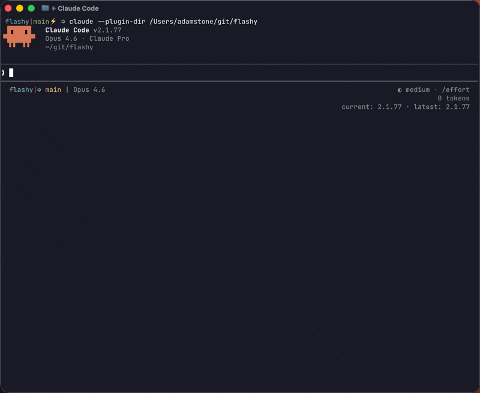

# ⚡ Flashy

Visual terminal flash notifications for Claude Code.

When Claude finishes a turn, is waiting for your input, or detects you've stepped away, Flashy pulses your terminal's background color.

- **Stop event** → 1 pulse (subtle "I'm done")
- **Notification event** → 2 pulses (stronger "come back") — Claude Code decides when to fire this (e.g., after detecting you're idle), so the timing before you see the flash depends on Claude Code, not Flashy



## Install

```bash
claude plugin marketplace add foundinblank/flashy
claude plugin install flashy@foundinblank/flashy
```

Flashy auto-detects your terminal's background color and computes an adaptive flash color. Run `/test-flashy` to test it out.

## Configuration

Create `~/.config/flashy/config` (or `$XDG_CONFIG_HOME/flashy/config`) to customize. See [`config.default`](config.default) for all options with descriptions.

Quick start:

```bash
cp /path/to/flashy/config.default ~/.config/flashy/config
# Edit to taste
```

### Options

| Option | Default | Description |
|--------|---------|-------------|
| `ENABLED` | `true` | Set `false` to disable without uninstalling |
| `STOP_PULSES` | `1` | Pulse count for Stop events |
| `NOTIFICATION_PULSES` | `2` | Pulse count for Notification events |
| `PULSE_DURATION` | `0.22` | Seconds each pulse is visible |
| `PULSE_GAP` | `0.1` | Seconds between consecutive pulses |
| `SHIFT` | `50` | RGB shift intensity (0-255). Higher = more visible |
| `FALLBACK_COLOR` | `#1a1b26` | Used when auto-detect fails |
| `BG_COLOR_FILE` | *(empty)* | Per-TTY bg color file pattern. Use `{tty}` placeholder |

## Terminal Compatibility

| Terminal | Auto-detect | Flash | Notes |
|----------|:-----------:|:-----:|-------|
| Ghostty | ✅ | ✅ | Full support |
| iTerm2 | ✅ | ✅ | Full support |
| Kitty | ✅ | ✅ | Full support |
| WezTerm | ✅ | ✅ | Full support |
| Alacritty | ✅ | ✅ | Full support |
| foot | ✅ | ✅ | Full support |
| tmux | ⚠️ | ✅ | Needs `allow-passthrough on` for auto-detect |
| VS Code | ❌ | ✅ | Set `FALLBACK_COLOR` in config |
| Terminal.app | ❌ | ❌ | Not supported (no OSC 11) |

## Troubleshooting

**I don't see any flash**
- Check the compatibility table above. Terminal.app isn't supported.
- Try setting `FALLBACK_COLOR` in your config to your terminal's actual background color.

**Flash color doesn't restore properly**
- Set `FALLBACK_COLOR` to your terminal's background color, or use `BG_COLOR_FILE` if you have a multi-theme setup.

**Claude shows a hook error**
- Verify the script is executable: `chmod +x /path/to/flashy/hooks/flash.sh`
- Run it manually to check for errors: `./hooks/flash.sh stop`

**Double flashes**
- If you previously had manual Stop/Notification hooks in `~/.claude/settings.json` calling a flash script, remove those entries. Flashy replaces them.

## How It Works

1. Claude Code fires a Stop or Notification hook event
2. `flash.sh` loads config from `~/.config/flashy/config` (if it exists)
3. Detects your terminal's current background color via:
   - Per-TTY color file (if configured)
   - OSC 11 terminal query (auto-detect)
   - Static fallback color
4. Computes perceived luminance — dark themes get a lighter flash, light themes get a darker flash
5. Pulses: sets bg → flash color, sleeps, restores original bg

## License

MIT License - see LICENSE file for details